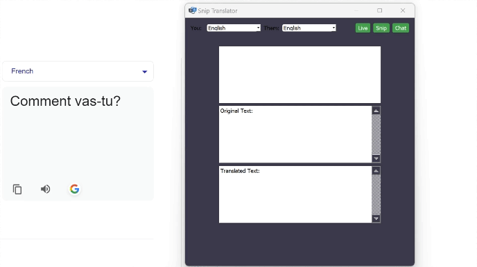

# Snip Translator

The Snip Translator is a PyQt5 application that allows users to translate text from screenshots in real-time. It includes features like language detection, translation, and chat functionality using PyAutoGUI.

## Overview

The Snip Translator is a powerful tool that enables users to translate text from images in real-time. It integrates seamlessly with the PyQt5 framework and offers a user-friendly interface for easy operation.

## Demo

Watch a quick demo of the Snip Translator in action:

## Key Features

- **Real-Time Translation:** Translate text from screenshots instantly.
- **Language Detection:** Automatically detect the language of the text.
- **Customizable Language Preferences:** Set your default and translated languages.
- **Chat Functionality:** Type and translate messages in the chat bar.

## Getting Started
Python 3.12.1
1. Clone the repository or download the ZIP file.
2. Install the required Python packages using `pip install -r doc/requirements.txt`.
3. Launch the application using `python translation.py`.

## Usage Instructions

- **Set Default and Translated Languages:** Choose your default and translated languages using the dropdown menus.
- **Snip Area:** Click and drag to select the area of the screen you want to translate.
- **Start Translation:** Click the "Live" button to update OCR and translation process.
- **Chat Translation:** Click the "Chat" button to enable chat mode and translate your messages.
 (Ex Usage: After clicking "Chat", click the chatbox on Whatsapp, Skype, Discord, all messages will be translated and sent there in the future)

## Community and Contributions

Contributions to the Snip Translator project are welcome! Please refer to our contribution guidelines for more information.

## Disclaimer

The Snip Translator is an independent project and is not affiliated with any official service providers. Use it at your own discretion.

## Licensing

This project is licensed under the MIT License, allowing for open and unrestricted usage and modifications.

## Acknowledgments

We would like to thank the developers of PyQt5, EasyOCR, Google Translate, and PyAutoGUI for their valuable contributions to this project.

## Contact Us

For inquiries, suggestions, or collaborations, please contact us.

## Current Version

Version 1.0
